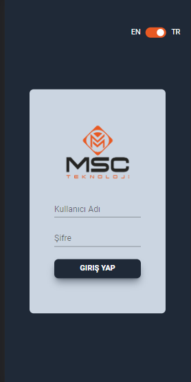
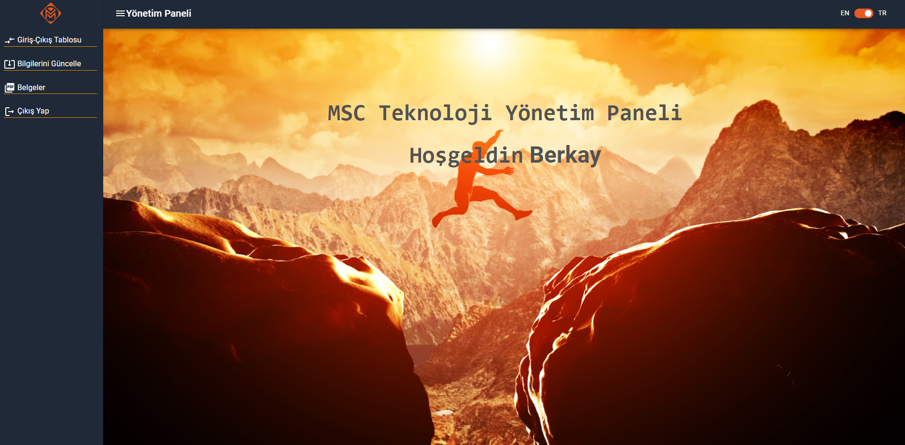
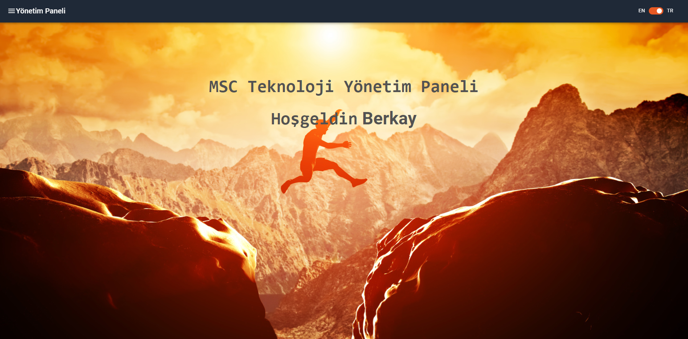
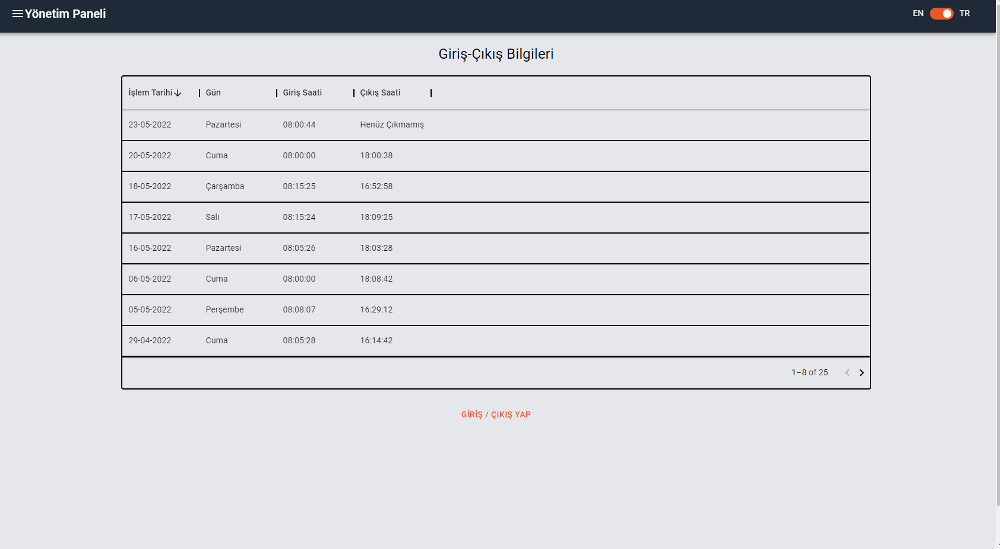
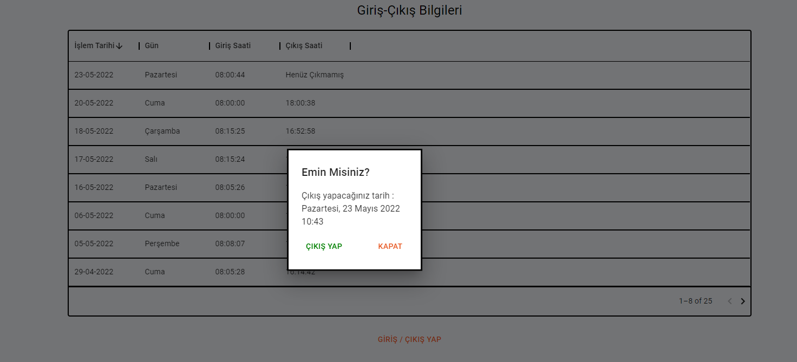
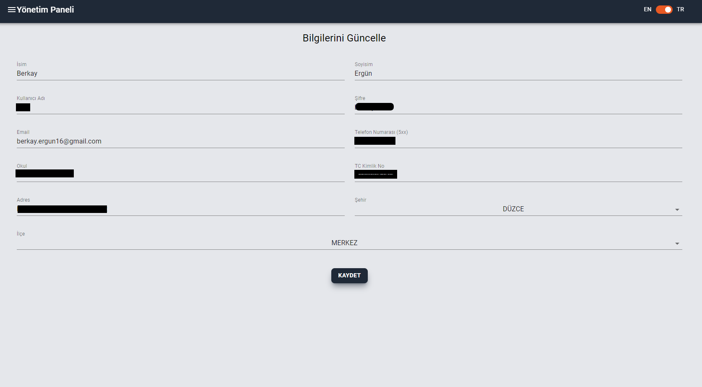
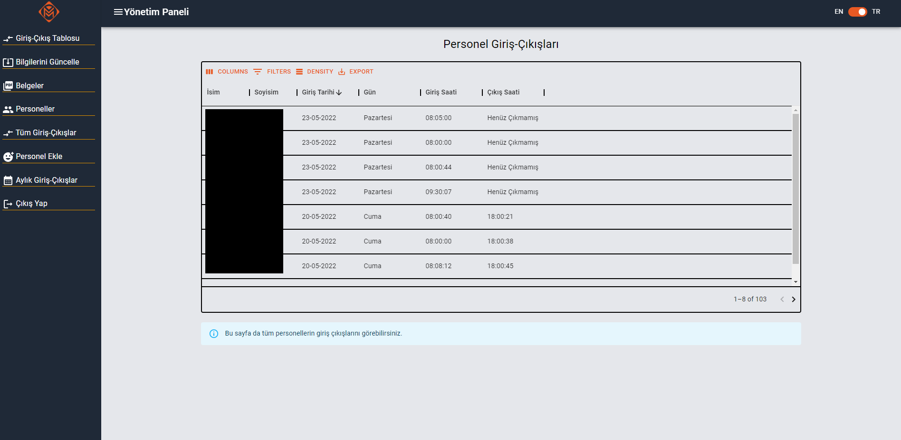

# 
MSC Teknoloji Personel Yönetim Sistemi 
 

> #  
Proje, şirket isteği doğrultusunda, personel giriş çıkış takibi yapabilmek amacıyla yazılmıştır. 
 

# Çözümlerimiz
- Admin tarafından personel giriş çıkışlarını görebilme
- Admin tarafından personel aylık giriş çıkışlarını görebilme
- Admin paneliyle kolayca yönetim
- Personelin tek tıkla giriş/çıkış yapabilmesi
- Personelin tüm kişisel bilgilerinin kolayca girilebilmesi
- Localization desteği
- Kolay, yönetilebilir ve sade tasarım

# Ekranlar
> ##  
Giriş 

</img>

 

#

> ##   
Personel Paneli 

</img>

 

#

> ##   
Personel Paneli Drawersiz 

</img>

 

#

> ##   
Personel'in Kendi Giriş Çıkışları 

</img>

 

#

> ##   
Personel'in Giriş/Çıkış Yapabildiği Buton 

</img>

 

#

> ##   
Personel'in Bilgilerini Güncelleyebildiği Ekran 

</img>

 

#

> ##   
Admin'in Ekranı 

</img>

 

#

# Kullanılan Teknolojiler

- > [React](https://tr.reactjs.org/)
  - [Material UI](https://mui.com/)
  - [TailwindCSS](https://tailwindcss.com/)
  - [Uniforms](https://uniforms.tools/)
  - [Redux Toolkit](https://redux-toolkit.js.org/)
  - [i18n Localization](https://react.i18next.com/)
  - [Lottie](https://www.npmjs.com/package/lottie-react-native)
  - [Momentjs](https://momentjs.com/)
  - [React Router](https://reactrouter.com/)
  - [React Toastify](https://www.npmjs.com/package/react-toastify)
  
  

- > [GraphQL](https://graphql.org/) 
  - [GraphQL Code Generator](https://www.graphql-code-generator.com/) 
- > [Apollo GraphQL](https://www.apollographql.com/docs/react/)
## Backend
- > [.NET Core Web API](https://docs.microsoft.com/tr-tr/aspnet/core/tutorials/first-web-api?view=aspnetcore-6.0&tabs=visual-studio)
  - [HotChocolate AspNetCore](https://chillicream.com/docs/hotchocolate)
  - [Entity Framework](https://docs.microsoft.com/tr-tr/ef/)

## Veritabanı
- > [PostgreSQL](https://www.postgresql.org/)

